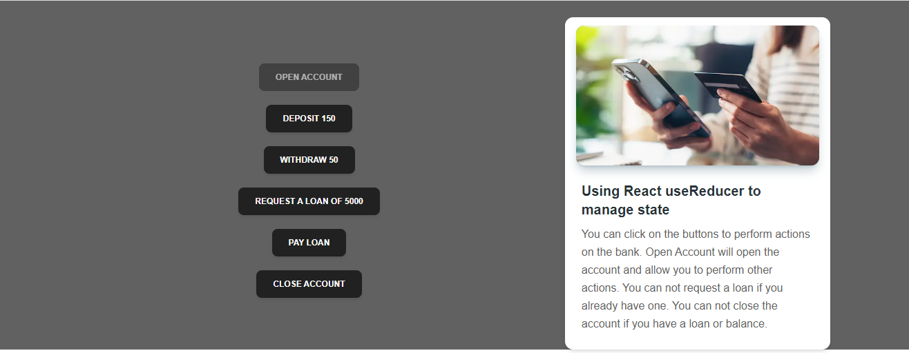

# UseReducer Bank Account

A simple bank account app using useReducer hook
Open Account will create a new account and you will be able to perform deposit and withdraw operations on it.
You cannot request a loan if you already have one.
You cannot close an account if you have a loan or if your balance is not 0.

## ScreenShot



## Installation

```bash
npm install
```

## Usage

```bash
npm run dev
```

## Site

To see the site in action, please visit [https://use-reducer-bank-account.netlify.app/](https://use-reducer-bank-account.netlify.app/)

# React + Vite

This template provides a minimal setup to get React working in Vite with HMR and some ESLint rules.

Currently, two official plugins are available:

- [@vitejs/plugin-react](https://github.com/vitejs/vite-plugin-react/blob/main/packages/plugin-react/README.md) uses [Babel](https://babeljs.io/) for Fast Refresh
- [@vitejs/plugin-react-swc](https://github.com/vitejs/vite-plugin-react-swc) uses [SWC](https://swc.rs/) for Fast Refresh
